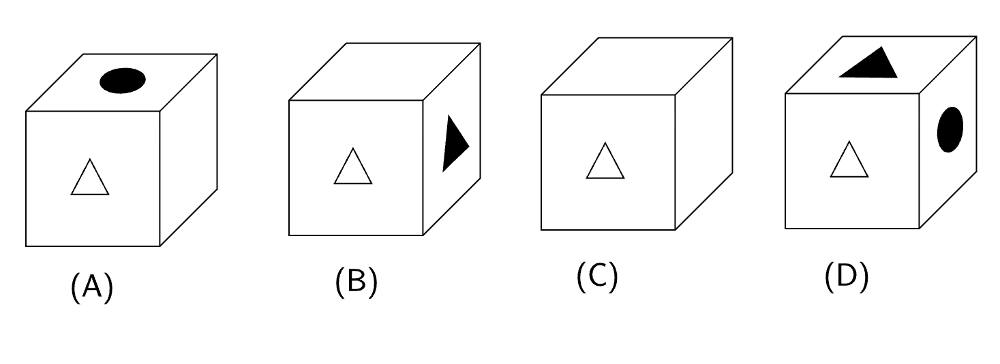

The paper as shown in the figure is folded to make a cube where each square
corresponds to a particular face of the cube. Which one of the following options
correctly represents the cube?

**Note**: The figures shown are representative.

The options are given below:

- [ ] A
- [ ] B
- [ ] C
- [ ] D

::: {.callout-note title="Answer" collapse=true}

- [x] A
- [ ] B
- [ ] C
- [ ] D

:::
