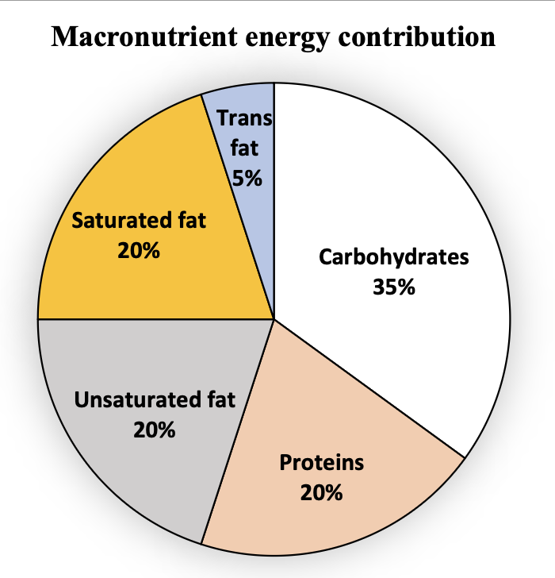

The pie chart presents the percentage contribution of different macronutrients to a typical 2,000 kcal diet of a person.

{width=50%}

The typical energy density (kcal/g) of these macronutrients is given in the table.

| **Macronutrient** | **Energy density (kcal/g)** |
|---------|:------:|
| Carbohydrates      | 4   | 
| Protiens     | 4  | 
| Unsaturated Fat       | 9    |
| Saturated Fat | 9 |
| Trans Fat | 9 |

The total fat (all three types), in grams, this person consumes is

- [ ] 44.4
- [ ] 77.8
- [ ] 100
- [ ] 3,600

::: {.callout-note title="Answer" collapse=true}

- [ ] 44.4
- [ ] 77.8
- [x] 100
- [ ] 3,600

:::

::: {.callout-note title="Soluton" collapse=true}

$45\%$ of the energy needs of this person comes from fat. This is 900 kcal. One gram of any kind of fat produces 9 kcal, therefore, we need 100 grams of fat to produce 900 kcal.

:::