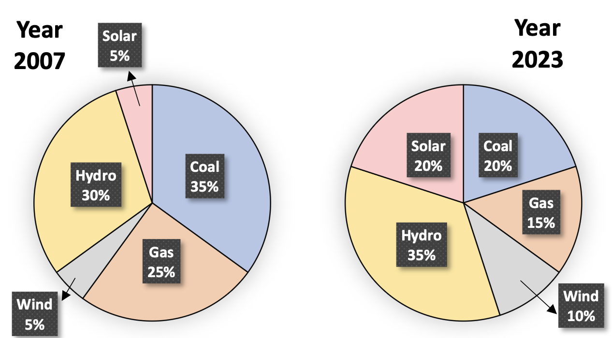

The pie charts depict the shares of various power generation technologies in the
total electricity generation of a country for the years 2007 and 2023.

The renewable sources of electricity generation consist of Hydro, Solar and Wind.
Assuming that the total electricity generated remains the same from 2007 to 2023,
what is the percentage increase in the share of the renewable sources of electricity generation over this period?

- [ ] 25%
- [ ] 50%
- [ ] 77.5%
- [ ] 62.5%

::: {.callout-note title="Answer" collapse=true}

- [ ] 25%
- [ ] 50%
- [ ] 77.5%
- [x] 62.5%

:::

::: {.callout-note title="Soluton" collapse=true}

Let the electricity generation be $\displaystyle E$. The contribution of renewables in 2007 is $\displaystyle 0.4E$ and in 2023 it is $\displaystyle 0.65E$. The percentage increase is:

$$
\frac{0.65E-0.4E}{0.4E} \times 100=62.5\%
$$

:::