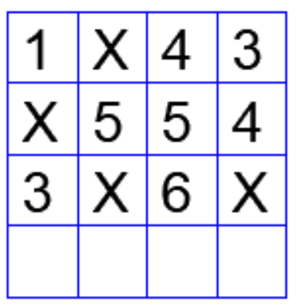

In the 4 × 4 array shown below, each cell of the first three rows has either a
cross (X) or a number.

The number in a cell represents the count of the immediate neighboring cells
(left, right, top, bottom, diagonals) NOT having a cross (X). Given that the last row has no crosses (X), the sum of the four numbers to be filled in the last row is

- [ ] 11
- [ ] 10
- [ ] 12
- [ ] 9

::: {.callout-note title="Answer" collapse=true}

- [x] 11
- [ ] 10
- [ ] 12
- [ ] 9

:::

::: {.callout-note title="Soluton" collapse=true}

From looking at the third row, it should be clear that the last row has four numbers. Therefore, these four numbers have to be $2, 4, 3, 2$. The sum is $11$.

:::