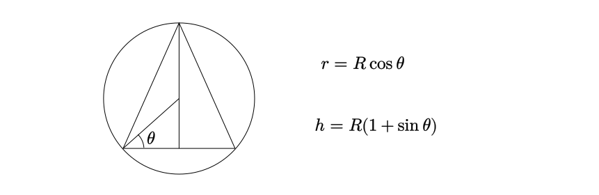

The height of a right circular cone of maximum volume that can be enclosed within a hollow sphere of radius $\displaystyle R$ is:

- [ ] $\displaystyle R$

  

- [ ] $\displaystyle \frac{5}{4} R$

  

- [ ] $\displaystyle \frac{4}{3} R$

  

- [ ] $\displaystyle \frac{3}{2} R$

::: {.callout-note title="Answer" collapse=true}

- [ ] $\displaystyle R$

  

- [ ] $\displaystyle \frac{5}{4} R$

  

- [x] $\displaystyle \frac{4}{3} R$

  

- [ ] $\displaystyle \frac{3}{2} R$

:::

::: {.callout-note title="Solution" collapse=true}

Invoking symmetry, we have:

It is safe to assume that $\displaystyle \theta \in ( 0,\pi /2)$. The expression for the volume as a function of  $\theta$ is:

$$
\begin{equation*}
V_{\text{cone}} =\frac{1}{3} \pi ( R\cos \theta )^{2}[ R( 1+\sin \theta )] \varpropto \cos^{2} \theta ( 1+\sin \theta )
\end{equation*}
$$

We can now rewrite the expression to be optimized as:

$$
\begin{equation*}
\left( 1-\sin^{2} \theta \right)( 1+\sin \theta ) =-\sin^{3} \theta -\sin^{2} \theta +\sin \theta +1
\end{equation*}
$$

Letting $\displaystyle y=\sin \theta$ and noting that $\displaystyle y\in ( 0,1)$, we get:

$$
\begin{equation*}
f( y) =-y^{3} -y^{2} +y+1
\end{equation*}
$$

$\displaystyle f^{\prime }( y) =0\Longrightarrow 3y^{2} +2y-1=0\Longrightarrow y=\frac{1}{3} ,-1$. We can ignore $\displaystyle -1$ as it is extraneous. Since $\displaystyle f^{\prime \prime} \left(\frac{1}{3}\right) < 0$, we conclude that $\displaystyle y=\frac{1}{3}$ is a local maximum. Since $\displaystyle f( 0) =1$, $\displaystyle f( 1) =0$ and $\displaystyle f\left(\frac{1}{3}\right)  >1$, we conclude that $\displaystyle \frac{1}{3}$ corresponds to an absolute maximum in $\displaystyle ( 0,1)$ for $\displaystyle f$. 

Plugging this back in the expression for height, we get $\displaystyle h=R\left[ 1+\frac{1}{3}\right] =\frac{4}{3} R$.

:::