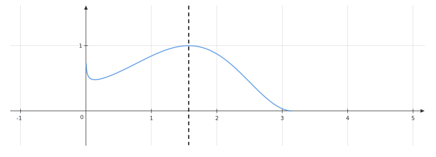

If $\displaystyle f( x) =(\sin x)^{\sqrt{x}}$, find $\displaystyle f^{\prime }( \pi /2)$.

::: {.callout-note title="Hint" collapse=true}

Take $\log$ on both sides.

:::

::: {.callout-note title="Answer" collapse=true}

$0$

:::

::: {.callout-note title="Solution" collapse=true}

We have:

$$
\begin{equation*}
\begin{aligned}
y & =(\sin x)^{\sqrt{x}}\\
 & \\
\ln y & =\sqrt{x}\ln(\sin x)\\
 & \\
\frac{1}{y}\frac{dy}{dx} & =\frac{\sqrt{x}}{\sin x}\cos x+\cfrac{\ln(\sin x)}{2\sqrt{x}}\\
 & \\
\Longrightarrow f^{\prime }( x) & =(\sin x)^{\sqrt{x} -1}\left[\frac{2x\cos x+\ln(\sin x)\sin x}{2\sqrt{x}}\right]
\end{aligned}
\end{equation*}
$$

We see that $\displaystyle f^{\prime }( \pi /2) =0$. Let us visualize and see how things look around $\displaystyle x=\pi /2$:

:::
