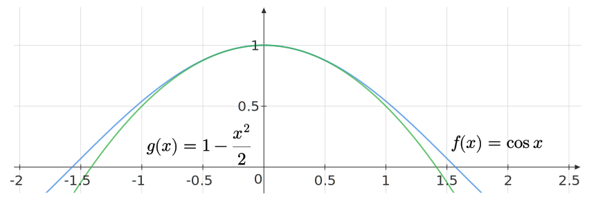

Find values for the constants $\displaystyle a,b$ and $\displaystyle c$ that will make

$$
\begin{equation*}
f( x) =\cos x\ \ \ \text{  and  } \ \ g( x) =a+bx+cx^{2}
\end{equation*}
$$

satisfy the conditions

$$
\begin{equation*}
f( 0) =g( 0) ,\ \ \ f^{\prime }( 0) =g^{\prime }( 0) ,\ \ \ \ f^{\prime \prime }( 0) =g^{\prime \prime }( 0)
\end{equation*}
$$

Enter $\displaystyle a^{2} +b^{2} +c^{2}$ as your answer.

::: {.callout-note title="Answer" collapse=true}

$2$

:::

::: {.callout-note title="Solution" collapse=true}

We have:

$$
\begin{equation*}
\begin{aligned}
f( 0) & =g( 0)
\end{aligned} \Longrightarrow a=1
\end{equation*}
$$

$$
\begin{equation*}
f^{\prime }( 0) =g^{\prime }( 0) \Longrightarrow b=0
\end{equation*}
$$

$$
\begin{equation*}
f^{\prime \prime }( 0) =g^{\prime \prime }( 0) \Longrightarrow c=-1
\end{equation*}
$$

Notice that $\displaystyle g$ is actually a local, second order approximation to $\displaystyle f$ at $\displaystyle x=0$:

:::
