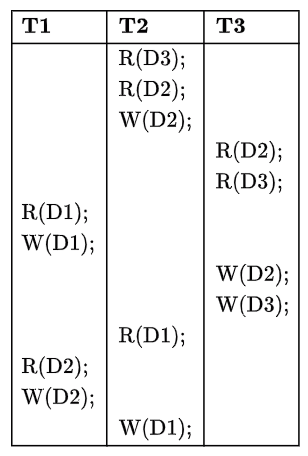

Consider three data items $D1,D2$, and $D3$, and the following execution schedule of transactions $T1,T2$, and $T3$. In the diagram, $R(D)$ and $W(D)$ denote the actions reading and writing the data item $D$ respectively.

Which of the following statements is correct?

- [ ] The schedule is serializable as $T2;T3;T1$  
- [ ] The schedule is serializable as $T2;T1;T3$  
- [ ] The schedule is serializable as $T3;T2;T1$  
- [ ] The schedule is not serializable

::: {.callout-note title="Answer" collapse=true}

- [ ] The schedule is serializable as $T2;T3;T1$
- [ ] The schedule is serializable as $T2;T1;T3$
- [ ] The schedule is serializable as $T3;T2;T1$
- [x] The schedule is not serializable

:::

