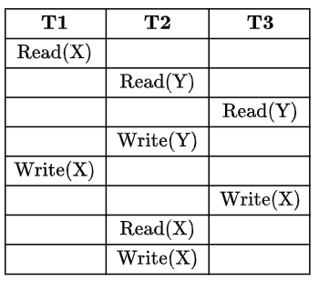

Consider the following schedule for transactions 𝑇1, 𝑇2 and 𝑇3:

Which one of the schedules below is the correct serialization of the above?

- [ ] 𝑇1→𝑇3→𝑇2  
- [ ] 𝑇2→𝑇1→𝑇3  
- [ ] 𝑇2→𝑇3→𝑇1  
- [ ] 𝑇3→𝑇1→𝑇2

::: {.callout-note title="Answer" collapse=true}

- [x] 𝑇1→𝑇3→𝑇2  
- [ ] 𝑇2→𝑇1→𝑇3  
- [ ] 𝑇2→𝑇3→𝑇1  
- [ ] 𝑇3→𝑇1→𝑇2

:::

