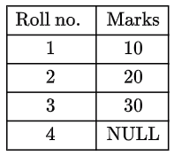

A table T1 in a relational database has the following rows and columns: 

The following sequence of SQL statements was successfully executed on table T1.

Update T1 set marks \= marks \+ 5

Select avg(marks) from T1

What is the output of the select statement?

1. 18.75  
2. 20  
3. 25  
4. Null

::: {.callout-note title="Answer" collapse=true}

Answer: C

:::

