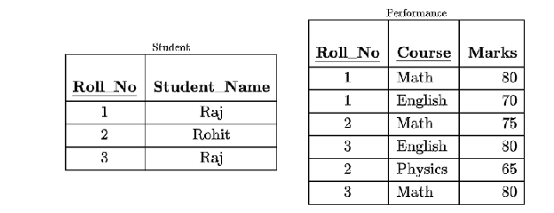

Consider the following relations:

Consider the following SQL query.

SELECT S.Student\_Name, Sum(P. Marks) 

FROM Student S, Performance P

WHERE S.Roll\_No\= P.Roll\_No

GROUP BY S.STUDENT\_Name

The numbers of rows that will be returned by the SQL query is\_\_\_\_\_\_\_\_\_\_\_\_\_\_\_\_\_.

::: {.callout-note title="Answer" collapse=true}

Answer: 2

:::

