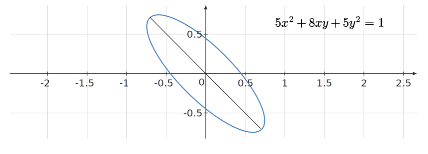

An ellipse can be represented by a quadratic form whose coefficient matrix is positive definite. The general equation is given by:
$$
\begin{bmatrix}
x & y
\end{bmatrix}A \begin{bmatrix}
x\\
y
\end{bmatrix} = 1
$$
Visually:

Consider the ellipse given by:

$$
\begin{equation*}
5x^{2} +8xy+5y^{2} =1
\end{equation*}
$$

Select all true statements concerning the major axis of this ellipse.

- [ ] A unit vector along the major axis of the ellipse is $\displaystyle \left(\frac{1}{\sqrt{2}} ,\frac{1}{\sqrt{2}}\right)$.
- [ ] A unit vector along the major axis of the ellipse is $\displaystyle \left(\frac{-1}{\sqrt{2}} ,\frac{1}{\sqrt{2}}\right)$.
- [ ] The length of the major axis of the ellipse is $\cfrac{2}{3}$.
- [ ] The length of the major axis of the ellipse is $\displaystyle 2$.

::: {.callout-note title="Hint" collapse=true}

Diagonalize the coefficient matrix corresponding to the quadratic form.

:::

::: {.callout-note title="Answer" collapse=true}

- [ ] A unit vector along the major axis of the ellipse is $\displaystyle \left(\frac{1}{\sqrt{2}} ,\frac{1}{\sqrt{2}}\right)$.
- [x] A unit vector along the major axis of the ellipse is $\displaystyle \left(\frac{-1}{\sqrt{2}} ,\frac{1}{\sqrt{2}}\right)$.
- [ ] The length of the major axis of the ellipse is $\cfrac{2}{3}$.
- [x] The length of the major axis of the ellipse is $\displaystyle 2$.

:::

::: {.callout-note title="Solution" collapse=true}
#### Step-1

The coefficient matrix corresponding to the quadratic form is:

$$
\begin{equation*}
A=\begin{bmatrix}
5 & 4\\
4 & 5
\end{bmatrix}
\end{equation*}
$$

Let us now find the eigenvalues and eigenvectors of $\displaystyle A$:

$$
\begin{equation*}
\begin{aligned}
|A-\lambda I| & =\lambda ^{2} -10\lambda +9
\end{aligned}
\end{equation*}
$$

We get $\displaystyle \lambda =1,9$. Now for the eigenvectors:

#### Step-2

For $\displaystyle \lambda _{1} =1$:

$$
\begin{equation*}
\begin{bmatrix}
4 & 4\\
4 & 4
\end{bmatrix}\begin{bmatrix}
a\\
b
\end{bmatrix} =\begin{bmatrix}
0\\
0
\end{bmatrix}
\end{equation*}
$$

Any non-zero multiple of $\displaystyle ( -1,1)$ is an eigenvector. A unit eigenvector in this direction is $\displaystyle \frac{1}{\sqrt{2}}( -1,1)$.

For $\displaystyle \lambda _{2} =9$:

$$
\begin{equation*}
\begin{bmatrix}
-4 & 4\\
4 & -4
\end{bmatrix}\begin{bmatrix}
a\\
b
\end{bmatrix} =\begin{bmatrix}
0\\
0
\end{bmatrix}
\end{equation*}
$$

Any non-zero multiple of $\displaystyle ( 1,1)$ is an eigenvector. A unit eigenvector in this direction is $\displaystyle \frac{1}{\sqrt{2}}( 1,1)$.

The major axis lies along the eigenvector with the smallest eigenvalue, here $\displaystyle \lambda _{2} =1$, namely $\displaystyle \left(\frac{-1}{\sqrt{2}} ,\frac{1}{\sqrt{2}}\right)$. The length of the major axis is given by $\displaystyle \frac{2}{\sqrt{\lambda _{2}}} =2$. Let us visualize this ellipse:

:::