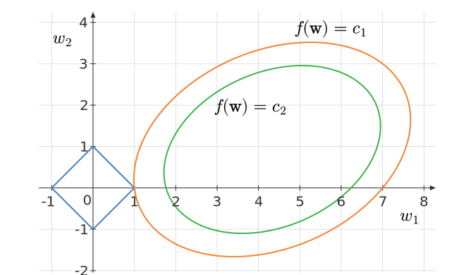

Consider the contours of the sum-of-squared-errors function in regression along with the contours of the regularizer.

Which of the following statements are true?

- [ ]  $c_1 > c_2$
- [ ]  $c_1 < c_2$
- [ ]  This corresponds to LASSO regression
- [ ]  This corresponds to ridge regression
- [ ]  The optimal weight vector is $(1, 0)$
- [ ]  The optimal weight vector is $(0, 1)$

::: {.callout-note title="Answer" collapse=true}

- [x]  $c_1 > c_2$
- [ ]  $c_1 < c_2$
- [x]  This corresponds to LASSO regression
- [ ]  This corresponds to ridge regression
- [x]  The optimal weight vector is $(1, 0)$
- [ ]  The optimal weight vector is $(0, 1)$

:::

::: {.callout-note title="Solution" collapse=true}

- The contours of the constraint are of the form:

$$
|w_1| + |w_2| = \theta
$$

- This corresponds to LASSO, which uses the $L_1$ norm for the weight vector. 
- The contours of the SSE function are elliptical. The center of the ellipse is the MLE solution. As we move outwards, the loss function's value increases. So $c_1 > c_2$. 
- The point of intersection of the contours of SSE with the contours of the $L_1$ norm is the solution. In this case, it is $(1, 0)$.

:::
