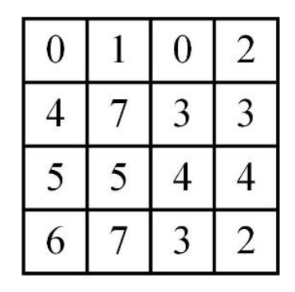

A $4 \times 4$ digital image has pixel intensities $(U)$ as shown in the figure. 

{width="200px"}

The number of pixels with $U \leqslant 4$ is:

- [ ] 3
- [ ] 8
- [ ] 11
- [ ] 9

::: {.callout-note title="Answer" collapse=true}

- [ ] 3
- [ ] 8
- [x] 11
- [ ] 9

:::