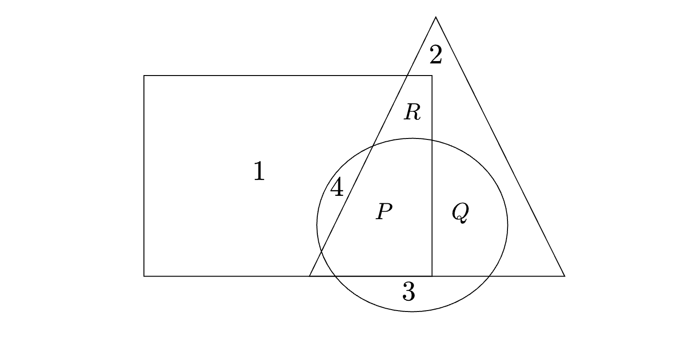

In the given figure, the numbers associated with the rectangle, triangle, and ellipse are 1, 2, and 3, respectively. 

Which one among the given options is the most appropriate combination of P, Q, and R?

- [ ] P = 6, Q = 5, R = 3
- [ ] P = 5, Q = 6, R = 3
- [ ] P = 3, Q = 6, R = 6
- [ ] P = 5, Q = 3, R = 6

::: {.callout-note title="Answer" collapse=true}

- [x] P = 6, Q = 5, R = 3
- [ ] P = 5, Q = 6, R = 3
- [ ] P = 3, Q = 6, R = 6
- [ ] P = 5, Q = 3, R = 6

:::

::: {.callout-tip title="Solution" collapse=true}

The rectangle, triangle, and ellipse are associated with the numbers 1, 2, and 3, respectively. If a region is covered by more than one shape, the numbers corresponding to those shapes are added together to get the value for that region. In this way, we can see that $P = 1 + 2 + 3$ since all three shapes overlap in that region, giving us $P = 6$. For region Q, it is covered by the triangle and ellipse, so $Q = 2 + 3 = 5$. Finally, region R is covered by the rectangle and triangle, so $R = 1 + 2 = 3$.

:::