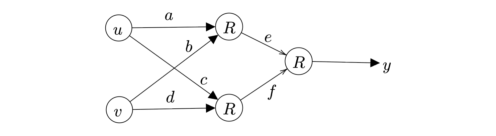

Consider the neural network shown in the figure with

 - inputs: $u,v$

 - weights: $a,b,c,d,e,f$

 - output: $y$

$R$ denotes the ReLU function, $R( x) =\max( 0,x)$.

Given $u=2,v=3$,

$a=1,b=1,c=1,d=-1,e=4,f=-1$,

which one of the following is correct?

 - [ ] $\cfrac{\partial y}{\partial a} =8,\cfrac{\partial y}{\partial f} =0$
 - [ ] $\cfrac{\partial y}{\partial a} =1,\cfrac{\partial y}{\partial f} =0$
 - [ ] $\cfrac{\partial y}{\partial a} =1,\cfrac{\partial y}{\partial f} =-1$
 - [ ] $\cfrac{\partial y}{\partial a} =2,\cfrac{\partial y}{\partial f} =-1$

::: {.callout-note title="Answer" collapse=true}

 - [x] $\cfrac{\partial y}{\partial a} =8,\cfrac{\partial y}{\partial f} =0$
 - [ ] $\cfrac{\partial y}{\partial a} =1,\cfrac{\partial y}{\partial f} =0$
 - [ ] $\cfrac{\partial y}{\partial a} =1,\cfrac{\partial y}{\partial f} =-1$
 - [ ] $\cfrac{\partial y}{\partial a} =2,\cfrac{\partial y}{\partial f} =-1$

:::

::: {.callout-note title="Solution" collapse=true}

Let us first perform the forward pass:

We have:

$$
\begin{array}{ r l l }
h_{1} & =au+bv & =5\\
a_{1} & =\max( 0,h_{1}) & =5\\
h_{2} & =cu+dv & =-1\\
a_{2} & =\max( 0,h_{2}) & =0\\
h_{3} & =ea_{1} +fa_{2} & =20\\
y & =\max( 0,h_{3}) & =20
\end{array}
$$

The path that is active in influencing $y$ is shown in green. The other path is not going to be active since $a_{2} =0$. So we see that $\cfrac{\partial y}{\partial f} =0$.

For the green path, we have:

$$
\begin{aligned}
 \begin{array}{l}
\cfrac{\partial y}{\partial a}\\
\end{array} & =\cfrac{\partial y}{\partial h_{3}} \times \cfrac{\partial h_{3}}{\partial a_{1}} \times \cfrac{\partial a_{1}}{\partial h_{1}} \times \cfrac{\partial h_{1}}{\partial a}\\
 & \\
 & =1\times e\times 1\times u\\
 & \\
 & =8
\end{aligned}
$$

The derivative ReLU is $1$ whenever the neuron is active.
:::