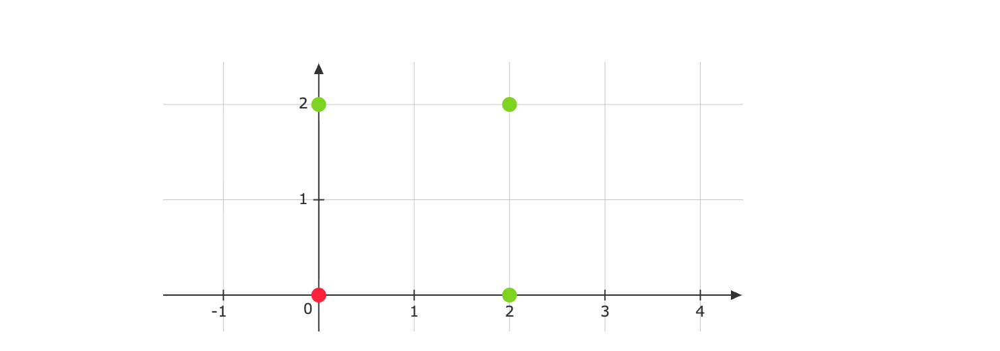
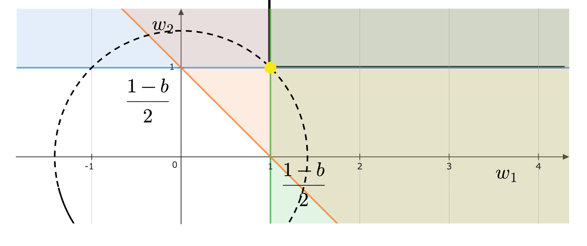
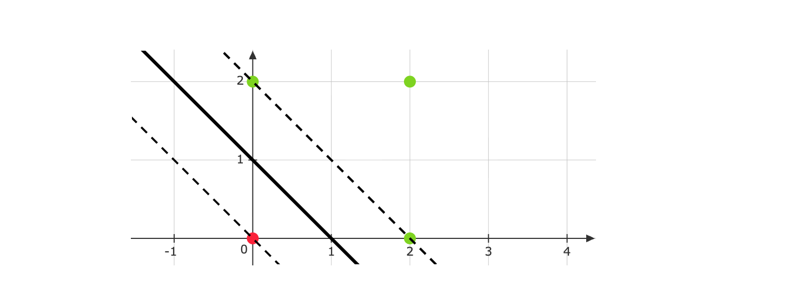

Consider designing a linear binary classifier $f( x) =\text{sign}\left( w^{T} x+b\right)$, $x\in \mathbb{R}^{2}$ on the following training data:

$$
\text{Class-1} :\ \left\{\begin{pmatrix}
2\\
0
\end{pmatrix} ,\begin{pmatrix}
0\\
2
\end{pmatrix} ,\begin{pmatrix}
2\\
2
\end{pmatrix}\right\} ,\ \text{Class-2} :\left\{\begin{pmatrix}
0\\
0
\end{pmatrix}\right\}
$$
Hard-margin support vector machine (SVM) formulation is solved to obtain $w$ and $b$. Which of the following options is/are correct?

 - [ ] $w=\begin{pmatrix}
4\\
4
\end{pmatrix}$ and $b=1$

 - [ ] The number of support vectors is $3$

 - [ ] The margin is $\sqrt{2}$
 
 - [ ] Training accuracy is $98\%$

::: {.callout-note title="Answer" collapse=true}

 - [ ] $w=\begin{pmatrix}
4\\
4
\end{pmatrix}$ and $b=1$

 - [x] The number of support vectors is $3$

 - [x] The margin is $\sqrt{2}$
 
 - [ ] Training accuracy is $98\%$

:::

::: {.callout-note title="Solution" collapse=true}

The data-points given to us are:

We now need to set up the optimization problem. Let the red point be given a label of $-1$ and the green points a label of $+1$. We have the primal problem:

$$
\begin{gather*}
\underset{w}{\min} \ \frac{||w||^{2}}{2}\\
\\
\text{subject to.}\\
\\
\begin{aligned}
( 2w_{1} +b) \cdot 1 & \geqslant 1\\
( 2w_{2} +b) \cdot 1 & \geqslant 1\\
b\cdot ( -1) & \geqslant 1
\end{aligned}
\end{gather*}
$$

Simplifying the constraints, we get:

$$
\begin{aligned}
w_{1} & \geqslant \frac{1-b}{2}\\
w_{2} & \geqslant \frac{1-b}{2}\\
b & \leqslant -1
\end{aligned}
$$

In the $w_{1} -w_{2}$ plane, if we plot the constraints and the contours of the objective, we see that the minimum is obtained just when the objective touches the constraint region. The point obtained is shown in yellow:

Therefore, $( w_{1} ,w_{2}) =\left(\frac{1-b}{2} ,\frac{1-b}{2}\right)$. The primal objective is minimized when $b=-1$ (since $b\leqslant -1$ is the third constraint, we choose the largest $b$ possible). This gives us $w=( 1,1)$ and $b=-1$. Plotting the decision boundary along with the supporting hyperplanes gives us:

The margin is $\frac{2}{||w||} =\frac{2}{\sqrt{2}} =\sqrt{2}$. Now for the support vectors. Even though three points lie on the supporting hyperplane, we can't directly call all of them support vectors. But in this case, all three are indeed support vectors. Notice that if we remove even one of these three points from the dataset, the decision boundary will be forced to change.

Finally, the training accuracy is $100\%$. After all, this is a linear separable dataset and we are using a hard-margin SVM.

:::