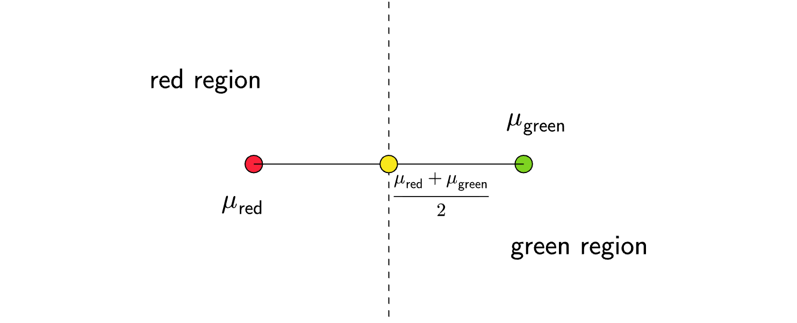

Consider a two-class problem in $\mathbb{R}^{d}$ with class labels red and green. Let $\mu _{\text{red}}$ and $\mu _{\text{green}}$ be the means of the two classes. Given test sample $x\in \mathbb{R}^{d}$, a classifier calculates the squared Euclidean distance (denoted by $||\cdot ||^{2}$) between $x$ and the means of the two classes and assigns the class label that the sample $x$ is closest to. That is, the classifier computes 
$$
f( x) =||\mu _{\text{red}} -x||^{2} -||\mu _{\text{green}} -x||^{2}
$$
and assigns the label red to $x$ if $f( x) < 0$, and green otherwise. Which of the following is/are correct?

 - [ ] The sample $x$ is assigned the label green if $||\mu _{\text{red}} ||< ||\mu _{\text{green}} ||$

 - [ ] $f$ is a linear function of $x$

 - [ ] $f( x) =w^{T} x+b$, where $w$ and $b$ are functions of $\mu _{\text{red}}$ and $\mu _{\text{green}}$

 - [ ] $f$ is a quadratic polynomial in $x$

::: {.callout-note title="Answer" collapse=true}

 - [ ] The sample $x$ is assigned the label green if $||\mu _{\text{red}} ||< ||\mu _{\text{green}} ||$

 - [x] $f$ is a linear function of $x$

 - [x] $f( x) =w^{T} x+b$, where $w$ and $b$ are functions of $\mu _{\text{red}}$ and $\mu _{\text{green}}$

 - [ ] $f$ is a quadratic polynomial in $x$

:::

::: {.callout-note title="Solution" collapse=true}

Let us visualize the setup:

We can expand the function $f$. Using $r$ for $\text{red}$ and $g$ for $\text{green}$:

$$
\begin{aligned}
f( x) & =||\mu _{r} -x||^{2} -||\mu _{g} -x||^{2}\\
 & =||\mu _{r} ||^{2} +||x||^{2} -2\cdot \mu _{r}^{T} x\\
 & -\left( ||\mu _{g} ||^{2} +||x||^{2} -2\cdot \mu _{g}^{T} x\right)\\
 & =\left( ||\mu _{r} ||^{2} -||\mu _{g} ||^{2}\right)\\
 & +2\cdot ( \mu _{g} -\mu _{r})^{T} x
\end{aligned}
$$
Setting $w=2\cdot ( \mu _{g} -\mu _{r})$ and $b=||\mu _{r} ||^{2} -||\mu _{g} ||^{2}$, we see that $f( x) =w^{T} x+b$, a linear function of $x$, where $w$ and $b$ are functions of $\mu _{r}$ and $\mu _{g}$. As for the sample $x=0$, we see that $f( 0) =||\mu _{r} ||^{2} -||\mu _{g} ||^{2}$. This will be assigned green if $f( 0) \geqslant 0$. Therefore the first option is wrong. 

**Note:** Geometrically, the perpendicular bisector of the line segment joining the two means is the decision boundary of the classifier.

:::