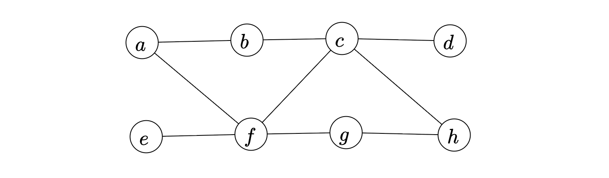

Let $G$ be a simple, unweighted, and undirected graph. A subset of the vertices and edges of $G$ are shown below.

It is given that $a-b-c-d$ is a shortest path between $a$ and $d$; $e-f-g-h$ is a shortest path between $e$ and $h$; $a-f-c-h$ is a shortest path between $a$ and $h$. Which of the following is/are NOT edges of $G$?

 - [ ] $( b,d)$

 - [ ] $( b,g)$

 - [ ] $( b,h)$

 - [ ] $( e,g)$

::: {.callout-note title="Answer" collapse=true}

 - [x] $( b,d)$

 - [ ] $( b,g)$

 - [x] $( b,h)$

 - [x] $( e,g)$

:::

::: {.callout-note title="Solution" collapse=true}

 - $( b,d)$ cannot be an edge of $G$. If this is an edge, then $a-b-d$ would be a shorter than than $a-b-c-d$.

 - $( b,h)$ cannot be an edge of $G$. If this is an edge, then $a-b-h$ is shorter than $a-f-c-h$.

 - $( e,g)$ cannot be an edge of $G$. If this is an edge, then $e-g-h$ is shorter than $e-f-g-h$.

$( b,g)$ can be an edge of $G$ as it doesn't disturb any of these shortest paths. $a-b-g-h$ is another shortest path from $a-h$, but its length is the same as that of $a-f-g-h$.

:::