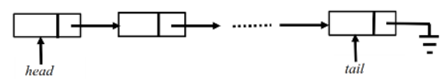

```python
class Node:
    def __init__(self,data):
        self.data = data
        self.next = None
```

Consider an implementation of a singly linked list, where each node is created using the given class `Node`. Suppose it has a `head` pointer that points to the first node of the linked list and a `tail` pointer that points to the last element of the linked list.



Suppose we want to perform the following operations on the given linked list:-

1. Insertion of the new node at the front of the linked list.
2. Insertion of the new node at the end of the linked list.
3. Deletion of the first node of the linked list.
4. Deletion of the last node of the linked list.

Which of the following option represents the correct complexity for each operation?

- [ ] $1 - O(1), 2 - O(n), 3 - O(1), 4 - O(1)$
- [ ] $1 - O(1), 2 - O(1), 3 - O(1), 4 - O(1)$
- [ ] $1 - O(1), 2 - O(n), 3 - O(1), 4 - O(n)$
- [ ] $1 - O(1), 2 - O(1), 3 - O(1), 4 - O(n)$

::: {.callout-note title="Answer" collapse=true}

- [ ] $1 - O(1), 2 - O(n), 3 - O(1), 4 - O(1)$
- [ ] $1 - O(1), 2 - O(1), 3 - O(1), 4 - O(1)$
- [ ] $1 - O(1), 2 - O(n), 3 - O(1), 4 - O(n)$
- [x] $1 - O(1), 2 - O(1), 3 - O(1), 4 - O(n)$

:::
