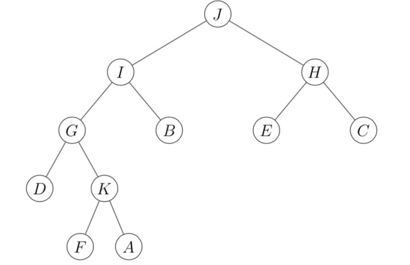

Suppose we obtain the following **DFS** tree rooted at node `J` for an undirected graph with vertices {A, B, C, D, E, F, G, H, I, J, K}.

Which of the following **can not** be an edge/edges in the original graph? 

- [ ] `(C,G)`
- [ ] `(B,J)`
- [ ] `(F,I)`
- [ ] `(A,H)`
- [ ] `(E,C)`

::: {.callout-note title="Answer" collapse=true}

- [x] `(C,G)`
- [ ] `(B,J)`
- [ ] `(F,I)`
- [x] `(A,H)`
- [x] `(E,C)`

:::
