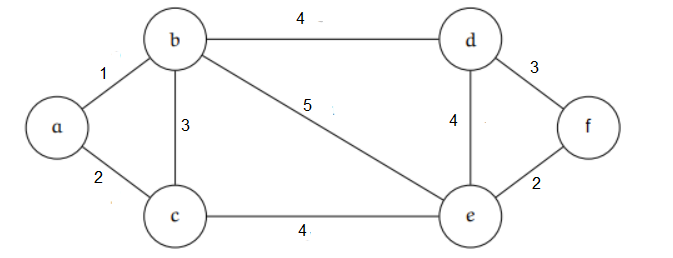

Consider the graph *G* given below.

Let $\alpha$ denote the number of minimum spanning trees of G and $\beta$ denote the weight of such a minimum spanning tree. 

The value of  $\alpha + \beta$ is _______________. 

::: {.callout-note title="Answer" collapse=true}

$14$

:::
