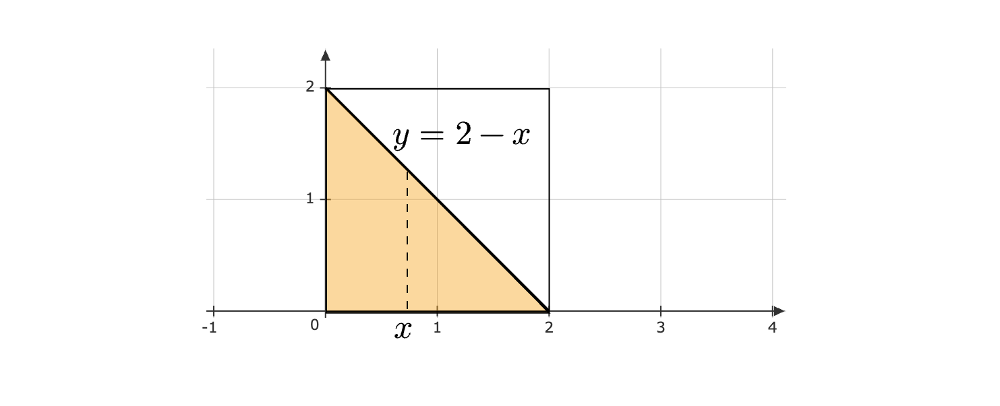

Let $( X,Y) \sim \text{Uniform}( D)$, where $D:=[ 0,2] \times [ 0,2]$. Find $P( X+Y< 2)$. Enter your answer correct to one decimal place.

::: {.callout-note title="Answer" collapse=true}

$0.5$	

:::

::: {.callout-note title="Solution" collapse=true}

The joint PDF of $X,Y$ is:

$$
f_{XY}( x,y) =\begin{cases}
\frac{1}{4} , & 0\leqslant x,y\leqslant 2\\
0, & \text{otherwise}
\end{cases}
$$

Now, consider the set of points satisfying $X+Y< 2$. We can visualize this as the shaded region given below:

We can now find the required probability by integrating the PDF over the orange region. We will allow $x$ to range from $0$ to $2$. For any $x$, the value of $y$ ranges from $0$ to $2-x$.

$$
\begin{aligned}
P( X+Y< 2) & =\int\limits _{0}^{2}\left[\int\limits _{0}^{2-x}\frac{1}{4} dy\right] dx\\
 & \\
 & =\int\limits _{0}^{2}\frac{2-x}{4} dx\\
 & \\
 & =0.5
\end{aligned}
$$

:::